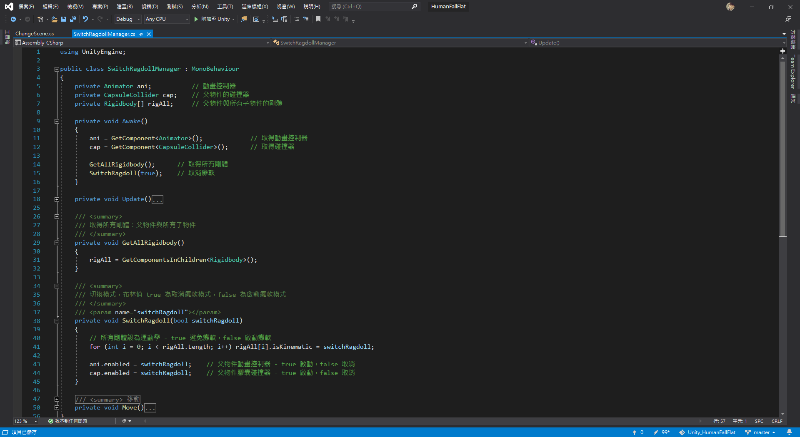
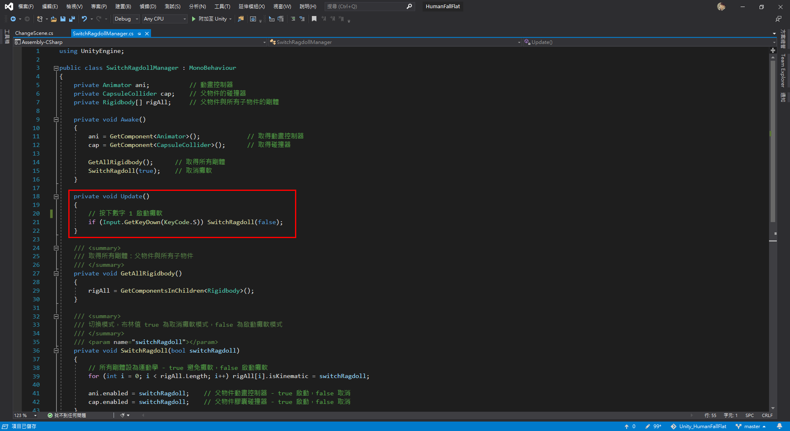

# Unity_HumanFallFlat
 Unity 人類一派塗地

參考影片：https://www.youtube.com/watch?v=DInV-jHm9rk

網頁展示：https://kid421.github.io/Unity_HumanFallFlat/Web/

# 切換癱軟效果教學

1. 定義切換癱軟效果類別

2. 呼叫切換癱軟效果
在需要的地方呼叫切換癱軟效果方法

